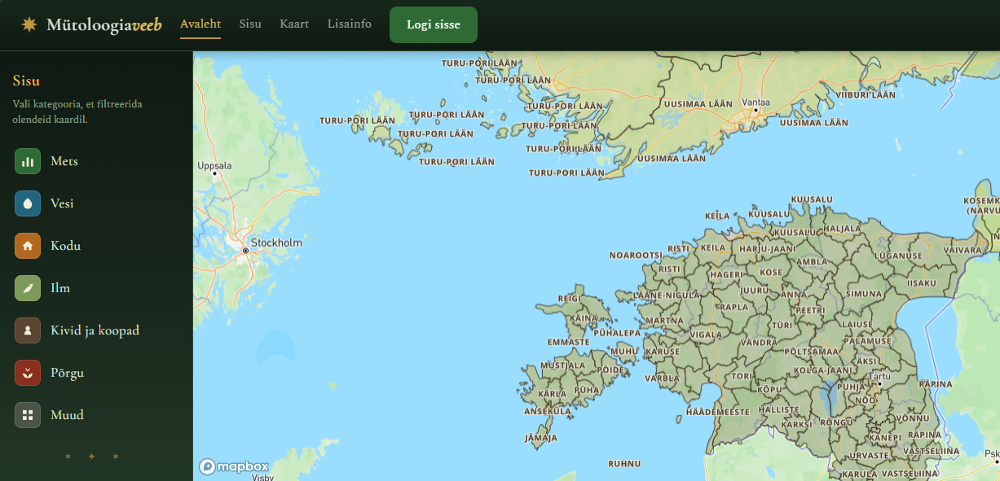

# Eesti Mütoloogiaveeb 

Hariduslik ja kultuuriline infosüsteem Eesti mütoloogilise pärimuse kohta.
Olendid on jaotatud seitsmesse mütoloogilisse sfääri ja seotud 1917. aasta
kihelkondade piiridega (Mapbox GL JS + GeoJSON).



## Eesmärk ja lühikirjeldus

Eesti mütoloogiline pärimus on laiali raamatutes, arhiivides ja akadeemilistes
allikates ning seda on tavakasutajal raske geograafiliselt ja temaatiliselt
hoomata. Mütoloogiaveeb koondab olendid ühte otsitavasse ja kaardipõhisesse
keskkonda, kus iga olend on seotud konkreetsete 1917. aasta kihelkondadega ja
varustatud allikaviidetega. Rakendus võimaldab sirvida, filtreerida ja
salvestada olendeid ning toimetajatel ja administraatoritel sisu lisada ja
modereerida. Nii muutub Eesti rahvapärimus interaktiivseks, kontrollitavaks ja
hariduslikult kasutatavaks tervikuks.

## Loomise raamistik

Projekt on valminud Tallinna Ülikooli Digitehnoloogiate Instituudi
õppetöö raames tarkvaraarenduse projekti kursuse arendusprojektina
(Meeskond 12). Töö ühendab akadeemilise usaldusväärsuse
(allikaviited, modereeritud sisu) tänapäevase kasutajakogemusega
(kaardipõhine avastamine, otsing ja filtreerimine).

## Autorid

- Artjom Kudrjašov
- Joosep Tawan Turba
- Olaf Anton Kirsberg

## Kasutatud tehnoloogiad ja versioonid

| Tehnoloogia | Versioon | Roll |
|-------------|----------|------|
| Node.js | >= 22.5.0 | käituskeskkond |
| Express | ^4.19.2 | HTTP-server, REST API marsruudid |
| node:sqlite (sisseehitatud) | Node 22.5+ | andmebaas, ei vaja kompileerimist |
| better-sqlite3 | ^11.3.0 | SQLite tagavara vanemale Node'ile |
| jsonwebtoken | ^9.0.2 | JWT autentimine (httpOnly küpsis) |
| bcryptjs | ^2.4.3 | paroolide räsimine |
| cookie-parser | ^1.4.6 | küpsiste lugemine |
| express-rate-limit | ^7.4.1 | päringusageduse piiramine |
| multer | ^2.1.1 | failide üleslaadimine |
| dotenv | ^16.4.5 | keskkonnamuutujate laadimine |
| Mapbox GL JS | v3.0.1 | kaart ja kihelkondade kuvamine |

**Frontend:** puhas SPA (HTML + CSS + vanilla JavaScript), hash-marsruuter —
raamistikku ei kasutata.

## Vaated (V1–V6)

1. **V1 Avaleht** - hero, otsing, sfäärid, esiletõstetud olendid
2. **V2 Olendite nimekiri** - filtreerimine (otsing, sfäär, kihelkond) + sortimine
3. **V3 Olendi detail** - pilt (lightbox), kirjeldus, helimängija, asukohakaart, allikad, seotud olendid
4. **V4 Admin** - tabel staatustega (roheline/hall/kollane), staatuse muutmine, kustutamine
5. **V5 Profiil** - kasutaja andmed, roll, lemmikud
6. **V6 Vorm** - uue olendi lisamine / muutmine, dünaamilised asukohad ja allikaviited

## Failistruktuur - kus mida muuta

| Fail / kaust | Sisu |
|--------------|------|
| `server.js` | Backend: REST API marsruudid, autentimine, rollid, andmebaasiloogika, sisu külvamine (`seedData`) |
| `turve.js` | Turvameetmed: turvapäised, CAPTCHA (Turnstile) kontroll, HSTS |
| `failid.js` | Failide üleslaadimine ja valideerimine (pildid, heli) |
| `database.sql` | Andmebaasi skeem (tabelid, kommentaarid, MySQL-migratsiooni juhised) |
| `public/index.html` | Frontendi struktuur ja menüü |
| `public/app.js` | Frontendi loogika: vaated, otsing, kaart, vormid |
| `public/style.css` | Kujundus |
| `.env` | Keskkonnamuutujad (ei lähe GitHubi) |

## Paigaldus- ja arenduskeskkonna juhised (lokaalne)

> See osa on **lokaalseks arenduseks**. Avalikuks juurutamiseks vaata allpool
> jaotist **„Toodangurežiimi seadistamine"**.

### Eeldused

- **Node.js 22.5.0 või uuem** (kontrolli: `node --version`).
  Node 22.5+ sisaldab sisseehitatud `node:sqlite` moodulit, mis ei vaja
  kompileerimist ega Visual Studio't.
- npm (tuleb Node'iga kaasa).
- Git (koodi allalaadimiseks).

### Sammud

```bash
# 1. Klooni repositoorium
git clone https://github.com/oosep/mytoloogiaveeb.git
cd mytoloogiaveeb

# 2. Paigalda sõltuvused
npm install

# 3. Loo keskkonnamuutujate fail
#    Kopeeri .env.example failiks .env ja täida väärtused
cp .env.example .env        # Windows PowerShell: copy .env.example .env

# 4. Käivita rakendus
npm start

# 5. Ava brauseris
#    http://localhost:3000
```

Lokaalsel (arendusrežiimi) esmakäivitusel luuakse automaatselt andmebaasifail
`mytoloogia.db`, **arenduse testkasutajad** ja näidisolendid.

## Keskkonnamuutujad

Kõik seaded antakse keskkonnamuutujatena (lokaalselt failis `.env`, serveris
majutaja seadetes). Veerg „Millal vaja" näitab, kas muutuja on kohustuslik
arenduses, toodangus või alati.

| Muutuja | Millal vaja | Selgitus |
|---------|-------------|----------|
| `NODE_ENV` | toodangus | sea väärtuseks `production`, et lülitada sisse toodangurežiim (turvalised küpsised, range CSRF-kaitse, vaikekasutajaid ei looda). Kui seadmata, töötab rakendus arendusrežiimis. |
| `JWT_SECRET` | alati | juhuslik salajane string JWT allkirjastamiseks. **Toodangus vähemalt 32 märki**, muidu server ei käivitu. |
| `MAPBOX_TOKEN` | kaardi jaoks | Mapboxi avalik token (`pk....`). |
| `LUBATUD_ORIGINID` | toodangus | komaeraldatud lubatud päritolu-URL-id koos `https://`-ga (nt su domeen). **Toodangus kohustuslik** muidu blokeeritakse kõik muutvad päringud, sh sisselogimine ja registreerimine. |
| `ADMIN_PAROOL` | toodangus | esmase administraatori parool (**vähemalt 12 märki**). Toodangus testkasutajaid ei looda; admin tekib sellest muutujast. |
| `ADMIN_EMAIL` | valikuline | esmase admini e-post (vaikimisi `admin@...`). |
| `TURNSTILE_SITE_KEY` | toodangus (registreerimiseks) | Cloudflare Turnstile **avalik** võti (CAPTCHA widget). |
| `TURNSTILE_SECRET_KEY` | toodangus (registreerimiseks) | Cloudflare Turnstile **salajane** võti. Ilma selleta on registreerimine toodangus blokeeritud. |
| `MANUSTE_VOTI` | valikuline | üleslaaditud failide krüpteerimisvõti. |
| `PORT` | valikuline | serveri port (vaikimisi 3000; pilvemajutajad annavad selle ise). |

Token ja saladused ei lähe kunagi GitHubi — `.env` on `.gitignore`-s, repos on
ainult `.env.example` näidisstruktuuriga.

## Kasutajarollid ja registreerimine

Süsteemis on kolm rolli: **kasutaja**, **toimetaja** ja **admin**.

- **Admin** näeb halduslauda, kinnitab sisu, muudab staatusi, kustutab olendeid.
- **Toimetaja** saab lisada/muuta olendeid — uus sisu läheb *modereerimisele*
  (admini lisatud sisu avaldatakse kohe).
- **Kasutaja** saab sirvida, otsida ja salvestada lemmikuid.

**Registreerimisel saab iga uus konto alati rolli `kasutaja`** (turvakaalutlustel
see väldib õiguste eskaleerumist). Toimetaja või administraatori õiguste
andmiseks peab olemasolev administraator muutma kasutaja rolli **otse
andmebaasis** (selleks eraldi liidest ei ole):

```sql
UPDATE kasutajad SET roll='toimetaja' WHERE kasutajanimi='kasutajanimi';
```

### Arenduse testkasutajad

> ⚠️ **Need testkasutajad luuakse AINULT arendusrežiimis** (kui `NODE_ENV` ei ole
> `production`). **Toodangus neid kontosid EI looda**  esmane administraator
> luuakse `ADMIN_PAROOL` keskkonnamuutujast (vt jaotist „Toodangurežiimi
> seadistamine"). Ära kunagi kasuta neid vaikeparoole avalikus toodangus.

| Kasutajanimi | Parool         | Roll       |
|--------------|----------------|------------|
| `admin`      | `admin123`     | admin      |
| `toimetaja`  | `toimetaja123` | toimetaja  |
| `kylastaja`  | `kylastaja123` | kasutaja   |

## Toodangurežiimi seadistamine (avalik juurutamine)

Rakendusel on kaks režiimi: **arendusrežiim** (vaikimisi, lokaalseks tööks) ja
**toodangurežiim** (avalikuks kasutamiseks). Avalikult  nt Tartu
Kirjandusmuuseumi serveris või pilvemajutajas (Railway)  tuleb käivitada
**toodangurežiimis**, sest see lülitab sisse turvalised küpsised, range
CSRF-kaitse ja jätab ära ebaturvalised vaikekasutajad.

Toodangurežiim aktiveerub, kui `NODE_ENV=production`. Lisaks tuleb seada allpool
toodud keskkonnamuutujad. **Ilma nendeta veeb ei tööta korralikult** (nt
sisselogimine või registreerimine ebaõnnestub).

### 1. Sea keskkonnamuutujad

```
NODE_ENV=production
JWT_SECRET=<vähemalt 32 juhuslikku märki>
ADMIN_PAROOL=<vähemalt 12 märki — esmase admini parool>
ADMIN_EMAIL=admin@näidis.ee
TURNSTILE_SITE_KEY=<Cloudflare Turnstile avalik võti>
TURNSTILE_SECRET_KEY=<Cloudflare Turnstile salajane võti>
MAPBOX_TOKEN=pk.<Mapboxi token>
LUBATUD_ORIGINID=https://sinu-domeen.ee
```

`JWT_SECRET` genereerimiseks:

```bash
node -e "console.log(require('crypto').randomBytes(48).toString('hex'))"
```

### 2. Samm-sammult Railway näitel

1. Deploy rakendus Railwayle (ühenda oma GitHubi repo).
2. Railway → **Settings → Networking** → **Generate Domain**. Kopeeri saadud
   link (nt `https://mytoloogiaveeb-production.up.railway.app`).
3. Railway → **Variables** → **RAW Editor** → kleebi ülaltoodud muutujad ja
   täida väärtused.
4. Sea `LUBATUD_ORIGINID` **täpselt võrdseks** sammu 2 lingiga (koos `https://`,
   **ilma** kaldkriipsuta lõpus).
5. Salvesta → Railway käivitab uue deploy. Oota, kuni see on valmis (roheline).
6. Ava domeen ja logi sisse kasutajaga `admin` ning parooliga, mille panid
   `ADMIN_PAROOL`-i.

> `PORT`-i ei pea seadma Railway annab selle ise ja rakendus kasutab
> `process.env.PORT`. Sama juhend kehtib ka oma serveri või Zone.ee puhul:
> seadista samad keskkonnamuutujad ja taga, et rakendus on **HTTPS-i taga**
> (turvaküpsised vajavad HTTPS-i).

### 3. CAPTCHA (Cloudflare Turnstile)

Registreerimine vajab toodangus Cloudflare Turnstile võtmeid:

1. Loo tasuta konto [Cloudflare Turnstile](https://www.cloudflare.com/products/turnstile/) all.
2. Loo uus widget ja sea **hostinimeks oma domeen**.
3. Kopeeri saadud **Site Key** → `TURNSTILE_SITE_KEY` ja **Secret Key** →
   `TURNSTILE_SECRET_KEY`.

> Ainult **testimiseks** pakub Cloudflare „alati läbiva" testvõtmepaari
> (`1x00000000000000000000AA` / `1x0000000000000000000000000000000AA`), mis
> töötab igal domeenil. **Neid ei tohi jätta päris toodangusse** - vaheta enne
> avalikku kasutust päris võtmete vastu.

### Kriitilised kohad (lollikindel kontroll)

- **`LUBATUD_ORIGINID` peab täpselt klappima** aadressiga, kust veebi avatakse
  (sama hostinimi, `https://`, ilma lõpukaldkriipsuta). Vale väärtus → iga
  sisselogimine ja registreerimine annab vea „Keelatud päritolu" (403). See on
  kõige sagedasem viga.
- **Esmane admin ja näidisolendid külvatakse ainult tühja andmebaasiga.**
  Esimesel toodangukäivitusel tekib admin `ADMIN_PAROOL`-ist. Kui andmebaas on
  juba olemas (varasemast käivitusest), admini ei looda - siis kustuta
  `mytoloogia.db` ja käivita uuesti.
- **`JWT_SECRET` peab toodangus olema vähemalt 32 märki**, muidu server keeldub
  käivitumast (turvakaitse).

### Kontroll pärast juurutamist

1. Avaleht laeb ja näidisolendid on nimekirjas.
2. Kaart laeb (Mapboxi token toimib).
3. Sisselogimine adminina → halduslaud avaneb.
4. Registreerimine uue kontoga → CAPTCHA läbib, konto luuakse.
5. Sisse- ja väljalogimine → sessioon püsib (HTTPS + turvaküpsis).

> **Märkus:** rakenduse sisene privaatsuspoliitika tekst (`public/app.js`)
> viitab majutajale  uue hosti puhul uuenda see õige majutaja nimega.

## Andmebaasi struktuur

Andmebaas luuakse automaatselt failist `database.sql` (või `server.js`
sisseehitatud skeemist). Kõik laused on `IF NOT EXISTS`  korduv käivitamine on
turvaline. Allpool tabelite ülevaade; täielik skeem koos kommentaaride ja
MySQL-migratsiooni juhistega on failis [`database.sql`](database.sql).

**Tabelid:**

- `kasutajad`  kasutajakontod (kasutajanimi, e-post, bcrypt-räsitud parool, roll)
- `olendid`  mütoloogilised olendid (nimi, kirjeldus, sfäär, staatus, pilt, heli, autor)
- `olendi_asukohad`  olendi seos 1917. a kihelkondadega (kihelkond, maakond)
- `allikad`  olendi allikaviited (viide, URL)
- `lemmikud`  kasutaja ja olendi seos (lemmikud)
- `manused`  üleslaaditud piltide/helifailide metaandmed (failid ise asuvad `uploads/` väljaspool veebijuurikat)
- `audit_logi`  turvalogi (sisselogimiskatsed, failitegevused jne)

Näidis — kasutajate tabeli loomise lause (kopeeritav):

```sql
CREATE TABLE IF NOT EXISTS kasutajad (
  id            INTEGER PRIMARY KEY AUTOINCREMENT,
  kasutajanimi  TEXT NOT NULL UNIQUE,
  email         TEXT NOT NULL UNIQUE,
  parool        TEXT NOT NULL,                       -- bcrypt räsi
  roll          TEXT NOT NULL DEFAULT 'kasutaja',    -- kasutaja | toimetaja | admin
  loodud_at     TEXT NOT NULL DEFAULT (datetime('now'))
);
```

Paroole ei külvata kunagi SQL-failist testkasutajad luuakse `server.js`
funktsioonis `seedData()`, kus paroolid bcrypt-räsitakse. Nii ei hoita paroole
kunagi avatekstina.

## Testid

```bash
npm test
```

Kasutab Node.js sisseehitatud testiraamistikku (`node --test`). Testid asuvad
kaustas `test/` (API, failivalideerimine jm).

Käsitsi testimise testilood ja tulemused on dokumenteeritud eraldi (vt
testilugude tabel ja testimise tulemuste aruanne).

## Juurutamine oma serverisse / Zone.ee (Node.js)

1. Lae kogu kaust üles serverisse (Zone.ee virtuaalserver vms).
2. **Zone App Manager** → loo uus Node.js rakendus, sea käivitusfailiks `server.js`.
3. Käivita `npm install` (App Manageri kaudu või SSH-iga).
4. Sea **kõik toodangu keskkonnamuutujad** (vt jaotist „Toodangurežiimi
   seadistamine"), sealhulgas `NODE_ENV=production`, `LUBATUD_ORIGINID` (oma
   domeen) ja Turnstile võtmed.
5. Taga, et rakendus on HTTPS-i taga.
6. Rakendus serveerib nii API-t kui ka frontendi samast pordist.

### MySQL alternatiiv

Failis `database.sql` on skeem kommenteeritud MySQL-i migratsioonijuhistega.
SQLite töötab ilma lisaseadistuseta; MySQL-i kasutamiseks kohanda `server.js`
andmebaasikiht (`better-sqlite3` → `mysql2`).

## Litsents

See projekt on litsentseeritud **MIT litsentsi** alusel vaata
[`LICENSE`](LICENSE) faili täisteksti jaoks.
